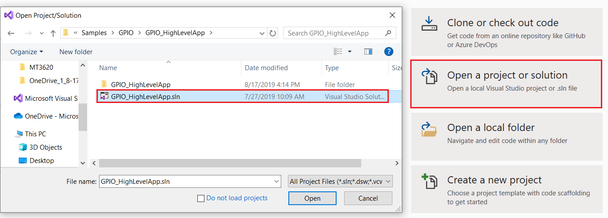
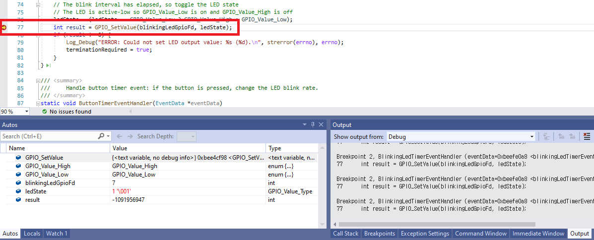

# Lab-1: Blinking LED

- Go to [Home Page](README.md)

## Goals

- Understand the basic sketch of Azure Sphere High-level Applicaiton
- Leann how to build & debug Application using Visual Studio
- Learn how to use GPIO API from Azure Sphere SDK

## Steps

1. Enable device debug and disable OTA in Azure Sphere utility
   
   `azsphere device prep-debug`

2. Clone Azure Sphere Samples repo

    `git clone https://github.com/Azure/azure-sphere-samples`

3. Open a project or solution in Visual Studio and navigate to the folder of *.\azure-sphere-samples\Samples\GPIO\GPIO_HighLevelApp*, open GPIO_HighLevelApp.sln and press **F5** to build and load the application onto the device for debugging.
   
 
   
4. LED1 start to blink after Application is loaded. Press **Button A** will change the blinking rate. Both LED1 and Button A are connected to GPIO pin and controlled by the high-level Application.

5. Select Line 74 and press **F9** to set a breakpoint on function *GPIO_SetValue*, you will see the program is halt and stop on this line. Continue with **F5** and now you can control the ON/OFF state of LED.

 

## Read more
- [Using GPIOs on Azure Sphere](https://docs.microsoft.com/en-us/azure-sphere/app-development/gpio)
- [Best practices for high-level Application](https://docs.microsoft.com/en-us/azure-sphere/app-development/initialization-termination)
- [Manage target hardware dependencies](https://docs.microsoft.com/en-us/azure-sphere/app-development/manage-hardware-dependencies)

