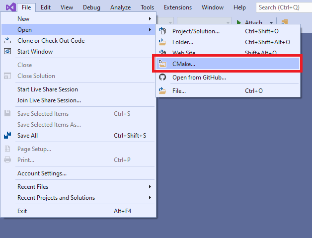
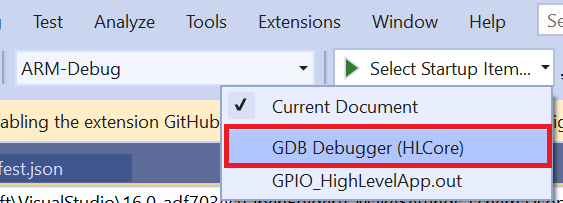

# Lab-1: GPIO 로 LED 제어하기

- [Home Page](README.md) 로 돌아가기

## 목적

- Azure Sphere High-level Applicaiton 의 기본적인 이해
- Visual Studio 를 이용해 Application 을 빌드하고 디버그하는 방법을 익힙니다.
- Azure Sphere SDK 의 GPIO API 사용방법을 익힙니다.

## 단계

1. Azure Sphere utility 에서 디바이스를 디버그 모드로 전환합니다. (OTA는 비활성화됨)
   
   `azsphere device enable-development`

2. Azure Sphere 예제 Repository 를 복사합니다.

    `git clone https://github.com/Azure/azure-sphere-samples`

3. Visual Studio 를 실행하여 `File - Open - CMake...` 를 차례로 클릭합니다.

3. `.\azure-sphere-samples\Samples\GPIO\GPIO_HighLevelApp`폴더로 이동한 후, CMakeLists.txt 를 선택합니다. 
   
 
 

예제 프로젝트가 열린 뒤 Select Start up item 을 GDB Debugger(HLCore) 선택 후 **F5** 를 누르면 빌드 후 디버깅을 위해 어플리케이션이 디바이스에 로드됩니다.

 
   
4. 응용 프로그램이 로드 된 후 LED1이 깜박이기 시작합니다. **버튼A**
를 누르면 깜박임 속도가 변경됩니다. LED1과 버튼A는 모두 GPIO 핀에 연결되며 High-level Applicaiton 에 의해 제어됩니다.

5. 74번 라인에서 **F9** 를 눌러 *GPIO_SetValue* 함수에 브레이크포인트를 설정하면, 
프로그램이 이 라인에서 멈추는 것을 볼 수 있습니다. 다시 **F5** 를 눌러 LED ON/OFF 를 제어하며 디버깅이 가능합니다.

 

## 도전

LED의 BLUE 색상을 ON/OFF 해봅니다.

> MT3620 RDB의 경우 LED2 의 BLUE 색상은 **GPIO17**에 연결되어 있고, *SAMPLE_RGBLED_BLUE* 로 하드웨어 정의 파일에 정의되어 있습니다.

> Starter Kit의 경우 USER LED의 BLUE 색상은 **GPIO10** 에 연결되어 있고, *$MT3620_GPIO10* 으로 manifest 파일에 추가할 수도 있습니다.

> 하드웨어 정의파일을 Starter Kit 으로 변경하고 manifest 파일과 어플리케이션도 변경해봅니다.(**avnet_mt3620_sk**)

## 더 보기
- [Azure Sphere의 GPIO 사용](https://docs.microsoft.com/ko-kr/azure-sphere/app-development/gpio)
- [High-level Application의 모범사례](https://docs.microsoft.com/ko-kr/azure-sphere/app-development/initialization-termination)
- [Target 하드웨어 종속성 관리](https://docs.microsoft.com/ko-kr/azure-sphere/app-development/manage-hardware-dependencies)

