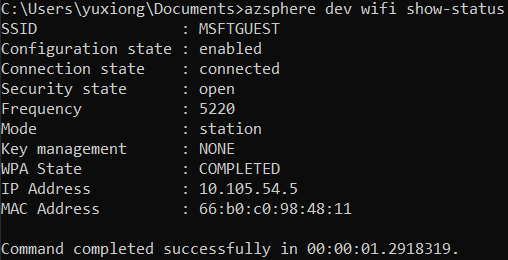

# Lab-3: Azure IoT Central 연결하기

- [Home Page](README.md)로 돌아가기

## 목적

- Azure IoT Central 설정을 실습해봅니다.
- IoT SaaS 솔루션으로서 IoT Central 이 제공하는 기본 기능들을 이해할 수 있습니다.
- Azure Sphere 와 Azure IoT Central 을 같이 사용하여 원격데이터 수집, 시각화 그리고 원격제어를 보안의 end-to-end 솔루션으로 구현할 수 있습니다.

## 단계

1.  Azure Sphere 개발보드를 PC에 연결하고 Azure Sphere utility 에서 디바이스를 디버그 모드로 전환합니다. (OTA는 비활성화)
   
    `azsphere device prep-debug`

2. 아래의 절차대로 Wi-Fi credential 이 설정되었는지 확인하고 Azure Sphere 를 AP에 연결합니다.

  - Wi-Fi SSID 와 패스워드를 설정하고 Azure Sphere 디바이스를 Azure Sphere 보안 서비스에 연결하도록 합니다.   
   `azsphere device wifi add --ssid <yourSSID> --key <yourNetworkKey>`
   
   > - 보안설정이 없는 Wi-Fi 네트워크 연결에서는 --key 플래그를 생략합니다.
   > - 만약 SSID 나 패스워드에 스페이스가 있는 경우는 " "처리 합니다. e.g. --ssid "My iPhone"

 -  아래의 커맨드로 AP에 연결되었는지 Wi-Fi 상태를 확인할 수 있습니다.
   
    `azsphere device wifi show-status`

    
    
    
   
3. [Setup IoT Central](https://docs.microsoft.com/ko-kr/azure-sphere/app-development/setup-iot-central) 페이지를 통해 cloud resourc 들을 설정합니다. 주요 단계는 아래와 같습니다.

    - Azure IoT Central Application 을 추가합니다.
    - Tenant CA 인증서를 IoT Central에 업로드하고 검증절차를 마무리합니다.

4. [Azure IoT Central](https://apps.azureiotcentral.com/) 의 내 어플리케이션으로 가서 홈페이지에 있는 **Create Device Templates** 을 클릭한 후, **Custom** 을 선택하여 빈 템플릿으로 시작합니다. 사용할 이름을 입력하고 **Create** 버튼을 눌러 추가합니다. 

    
   
5. **+ New** 버튼을 누르고 **Telemetry** 를 선택합니다.
   
   1. Display Name 과 Field Name 을 **Temperature**로 합니다.
   Field Name은 샘플 코드에 있는 이름과 정확히 일치해야만 하므로 대소문자에 유의합니다. 단위는 Degrees로 하고 최소 / 최대값은 각각 -40 과 85 로 설정합니다. Save를 클릭하여 저장합니다.

   2. 같은 방법으로 **Humidity** 를 추가합니다. 범위와 단위는 각각 0% 에서 100% 로 합니다.
   
   3. 같은 방법으로 **Pressure** 를 추가합니다. 범위와 단위는 각각 300 에서 1100hPa 로 합니다.

6. **+ New** 버튼을 클릭하고 **Event**를 선택합니다. Display Name 과 Field Name 을 **ButtonPress** 로 합니다. Save를 클릭하여 저장합니다.

    

7. 창의 왼쪽에서 디바이스를 선택한 다음 **+** 를 누르고 **Real** 을 선택하여 새로운 디바이스를 추가합니다. Device ID 와 Device Name 을 묻는 대화창이 나타납니다.

    

8. Azure Sphere Developer Command Prompt에서 아래의 커맨드를 입력합니다.
   
   `powershell -Command ((azsphere device show-attached)[0] -split ': ')[1].ToLower()`

   소문자로 출력된 Device ID 를 복사하여 대화창의 Device ID 항목에 붙여넣기 합니다. Device Name은 자동으로 Device ID에 맞게 변경됩니다. **Create** 버튼을 클릭합니다.

9. Visual Studio에서 'Open a project or solution'을 클릭합니다.
`.\azure-sphere-samples\Samples\AzureIoT` 폴더를 연 후, *AzureIoT.sln* 솔루션 파일을 선택합니다. 프로젝트를 빌드하기 전에 3가지 필수 정보를 *app_manifest.json* 파일에 입력을 해줍니다.
   
   - Azure Sphere 디바이스의 Tenant ID   
   - Azure IoT Central 어플리케이션의 Scope ID   
   - Azure IoT Central 어플리케이션의 IoT Hub URL 주소

    Tenant ID 는 아래의 Azure Sphere CLI 커맨드를 통해서 얻을 수 있습니다.

    `azsphere tenant show-selected`

    

    Scope ID 와 IoT Hub URL 을 쉽게 얻을 수 있는 툴이 *.\azure-sphere-samples\Samples\AzureIoT\Tools* 폴더에 있습니다. Azure Sphere 커맨드 라인 유틸리티에서 해당 폴더로 이동한 후, `ShowIoTCentralConfig.exe`를 실행하고, 'Y'를 입력합니다. 만약 로그인 창이 뜨면 내 Credential로 로그인합니다.

    

        
    출력된 정보들을 *app_manifest.json* 파일에 아래와 같이 추가해줍니다.

    

10. F5 를 눌러 빌드하고 어플리케이션을 실행합니다. Azure IoT Central 디바이스 대시보드로 이동하여 데이터를 확인합니다.

    

1. 링크 [page](https://github.com/Azure/azure-sphere-samples/blob/master/Samples/AzureIoT/IoTCentral.md#add-new-measurements-settings-and-properties) 로 이동하여 디바이스에서 report 된 'Orientation' 상태를 시각화하고 토글 설정을 사용하여 LED1을 제어하도록 IoT Central 애플리케이션을 구성합니다.

## 더 보기

- [What is Azure IoT Central](https://docs.microsoft.com/ko-kr/azure/iot-central/overview-iot-central)
- [Azure IoT Central Architecture](https://docs.microsoft.com/ko-kr/azure/iot-central/concepts-architecture)
- [Use I2C with Azure Sphere](https://docs.microsoft.com/ko-kr/azure-sphere/app-development/i2c)
- [Manage target hardware dependencies](https://docs.microsoft.com/ko-kr/azure-sphere/app-development/manage-hardware-dependencies)

