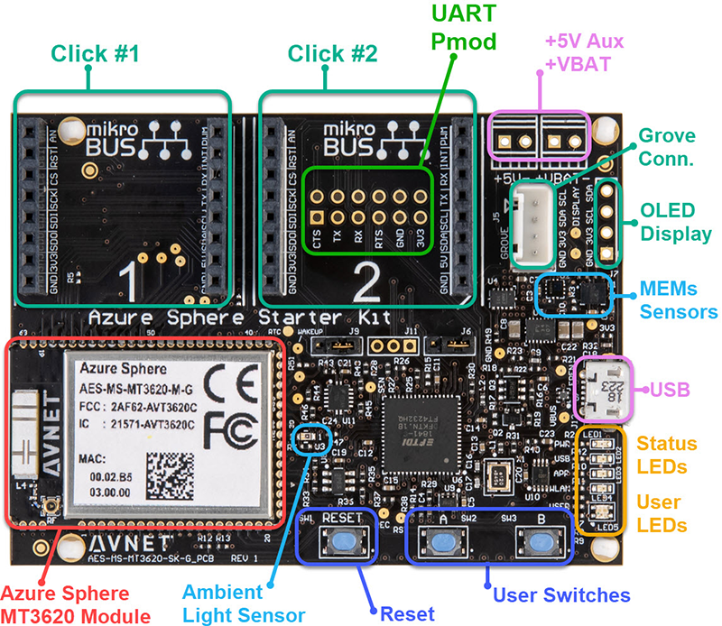

# 실습 0: 실습 환경 설치 및 설정 

|저자|[Samuel Park](https://github.com/avnetkor), Avnet Azure Sphere 기술지원담당, [@samuel](samuel.park@avnet.com) |
|:----|:---|
|Date| May 2020 |


이 Repo는 Azure Sphere Bootcamp 실습을 위해 작성되었습니다. 모든 실습을 따르고 마치는데 필요한 관련 정보를 제공합니다. 
## 커뮤니티
- [Softweb](https://www.softwebsolutions.com/microsoft-azure-sphere.html)
- [Hackster Azure sphere Project](https://www.hackster.io/search?i=projects&q=azure%20sphere)
- [element14 community](https://www.element14.com/community/groups/azuresphere)

## 문서

### Azure Sphere 문서
- [Azure Sphere 메인페이지](https://azure.microsoft.com/ko-kr/services/azure-sphere/)<br>
- [Azure Sphere 설명서](https://docs.microsoft.com/ko-kr/azure-sphere/)

### Azure Sphere (azsphere) 명령줄 참조
[Azsphere 명령줄 유틸리티](https://docs.microsoft.com/ko-kr/azure-sphere/reference/overview)

## 문제 해결
- [Windows에서 설치 및 설정 문제 해결](https://docs.microsoft.com/ko-kr/azure-sphere/install/troubleshoot-installation)
- USB를 통해 Azure Sphere에 연결하는 데 문제가있는 경우 사용하도록 설정 한 VPN을 비활성화해야합니다.
- OpenVPN 클라이언트를 포함하여 VPN 클라이언트와 함께 설치된 **TAP-Windows Adapter V9**는 Visual Studio 용 Azure Sphere SDK에서 필요로 설치 한 **TAP-Windows Adapter V9**와 호환되지 않습니다. VPN 클라이언트를 제거하고 Visual Studio 용 Azure Sphere SDK를 다시 설치해야합니다.

# 사전준비 내용

## [필수 조건 :](https://marketplace.visualstudio.com/items?itemName=AzureSphereTeam.AzureSphereSDKforVisualStudio2019)

- Windows 10 1주년 업데이트 이상을 실행하는 PC
- Visual Studio 2019 Enterprise, Professional, Community 버전 16.04 이상 또는 이후버전
- Azure Sphere Development Kit
---
## 단계 1: 소프트웨어 설치 하기 
- [Visual Studio 설치하기](https://www.visualstudio.com/)
- [Window용 Azure Sphere SDK 설치](https://docs.microsoft.com/ko-kr/azure-sphere/install/install-sdk)
    1. [Azure Sphere SDK 다운로드](https://aka.ms/AzureSphereSDKDownload/Windows)
    2. [Visual studio 마켓 플레이스](https://marketplace.visualstudio.com/vs) 에서 검색창에서 `Azure Sphere` 입력
    3. Visual Studio Extension for Azure Sphere 다운로드 
    4. Azure_Sphere_VS_20_04.vslx, Azure_Sphere_SDK_20_04.exe 을 설치 하기 
    5. [Git for Windows](https://git-scm.com/downloads)

전체 치짐은 [설정 프로시저 개요](https://docs.microsoft.com/ko-kr/azure-sphere/install/overview)를 참조

---
## 단계 2: Azure Sphere Tenant 설정 및 로그인 하기 

### Azure Sphere Developer Command Prompt

 Azure Sphere Developer Command prompt 시작하기 

1. <kbd>Windows Key</kbd> 클릭 
2. **Azure Sphere Developer Command Prompt** 타이핑 
3. **Azure Sphere Developer Command Prompt** 선택하여 실행하기

### 새로운 테넌트 사용자 생성하기 

**Lab 장치를 사용중이거나 이미 디바이스를 크레임 한 경우는 Skip**

 ```bash
azsphere login --newuser <email@address.com>
```

### 새로운 테넌트 생성 

**Lab 장치를 사용중이거나 이미 디바이스를 크레임 한 경우는 Skip**


```bash
azsphere tenant create -n <tenant_name>
```

### Azure Sphere 테넌트에 로그인

```bash
azsphere login
```

You will be prompted for the Azure Sphere Tenant credentials.

### 기본 Azure Sphere 테넌트 선택

1. 테넌트 리스트 

    ```bash
    azsphere tenant list
    ```

2. 기본 테넌트 선택

    **테넌트가 하나인 경우는 이 단계를 건너 뜁니다.**

    테넌트가 둘 이상 있으면 기본 테넌트를 설정해야합니다. 이전 단계에서 실행 한 ``azsphere tenant list``명령에서 ID를 복사해야합니다.

    ```bash
    azsphere tenant select -i <Tenant ID>
    ```

---
## 단계 3: 클레임 하기 

**Lab 장치를 사용중이거나 이미 디바이스를 크레임 한 경우는 Skip**

**주의**, Azure Sphere 장치를 클레임하는 것은 일회성 작업입니다. 장치는 Azure Sphere 테넌트 및 장치를 클레임 할 때 사용한 전자 메일 주소와 연결됩니다.

일단 클레임된 장치는 다른 Azure 테넌트로 ** 이동할 수 없습니다 **. 그러나 관리자 권한을 가진 [사용자 및 역할](https://docs.microsoft.com/en-us/azure-sphere/deployment/add-tenant-users?WT.mc_id=github-blog-dglover)을 Azure Sphere 테넌트에 추가 할 수 있습니다. 


    azsphere device claim


자세한 정보를 확인을 위해 [디바이스 클레임](https://docs.microsoft.com/ko-kr/azure-sphere/install/claim-device)을 클릭 

---

## 단계 4: Azure Sphere WiFi Network 설정


1. WiFi Access Points 스캔

    ```bash
    azsphere device wifi scan
    ```

2. 새로운 WiFi network connection 추가 

    ```bash
    azsphere device wifi add -s <Your WiFi SSID> -p <Your WiFI Password>
    ```

3. WiFi 연결상태 확인 

    ```bash
    azsphere device wifi show-status
    ```

    
4. 등록된 WiFi network 연결 리스트 . Run

    ```bash
    azsphere device wifi list
    ```

네트워킹에 대한 자세한 내용을 보려면 [Azure Sphere 디바이스에서 Wi-Fi 설정](https://docs.microsoft.com/ko-kr/azure-sphere/install/configure-wifi)

---
## 단계 5: Azure Sphere OS 업데이트 

현재 버전은 **20.04 Update 2** or 그 이상.


1. 장치 OS 버전 확인 

    ```bash
    azsphere device show-os-version
    ```
2. 업데이트 상태를 확인하려면 다음 명령을 입력

    ```bash
    azsphere device show-deployment-status
    
2. 복구 절차를 이용하여 보드 업데이트

    ```bash
    azsphere device recover
    ```

3. 적용을 위해서는 몇분이 소요되며 아래 명령으로 업데이트된 OS 버전확인 
    ```bash
    azsphere device show-os-version
    ```

추가 정보 확인하기 [디바이스 업데이트 받기](https://docs.microsoft.com/ko-kr/azure-sphere/install/configure-wifi)
---

## 단계 6: 업데이트 후에 wifi 연결 상태 확인 

WIFI연결이 Active 인지 확인하기 
```bash
azsphere device wifi show-status
```
WIFI 연결이 없다면 단계 6를 반복 

---

## 단계 7: 기존 어플리케이션 삭제

1. 아래 명령 실행 

    ```bash
    azsphere device sideload delete
    ```

2. Azure Sphere 재 시작 
    ```bash
    azsphere device restart
    ```

---

# 하드웨어
실습은  AVNET_MT3620_SK 보드를 사용할 수 있습니다.


## AVNET_MT3620_SK
자세한 정보는 [링크](https://www.element14.com/community/community/designcenter/azure-sphere-starter-kits)에서 확인 가능합니다.




## AVNET AzureSphere Start Kit Reference Design
AzureSphere Start Kit Reference Design 소프트웨어는 아래 링크에서 확인이 가능합니다.

# Samples
Azure sphere <br>
`git clone https://github.com/Azure/azure-sphere-samples`

Avnet<br> 
    `git clone https://github.com/Avnet/AvnetAzureSphereStarterKitReferenceDesign`

MediaTek <br>
    `git clone https://github.com/MediaTek-Labs/mt3620_m4_software.git`

CodethinkLabs<br> 
    `git clone https://github.com/CodethinkLabs/mt3620-m4-samples`    
    `git submodule update --init`
    
Azure Sphere Learning Path<br>
`git clone --depth 1 https://github.com/gloveboxes/Azure-Sphere-Learning-Path.git Azure-Sphere`

Azure Sphere OS Release<br>
`https://3rdpartysource.microsoft.com/`


# 실습
- [Lab-1 LED Blink](Lab-1.md) 
- [Lab-6 Applications on M4](Lab-6.md)


# Sample Code Disclaimer
Sample code – No Warranties THE SAMPLE CODE SOFTWARE IS PROVIDED “AS IS” AND WITHOUT WARRANTY. TO THE MAXIMUM EXTENT PERMITTED BY LAW, MICROSOFT DISCLAIMS ANY AND ALL OTHER WARRANTIES, WHETHER EXPRESS OR IMPLIED, INCLUDING, BUT NOT LIMITED TO, ANY IMPLIED WARRANTIES OF MERCHANTABILITY, NON-INFRINGEMENT, OR FITNESS FOR A PARTICULAR PURPOSE, WHETHER ARISING BY A COURSE OF DEALING, USAGE OR TRADE PRACTICE OR COURSE OF PERFORMANCE. In no event shall Microsoft, its licensors, the authors or copyright holders be liable for any claim, damages or other liability, whether in an action of contract, tort or otherwise, arising from, out of or in connection with the software or the use thereof.

This code may contain errors and/or may not operate correctly. Microsoft undertakes no duty to correct any errors or update the software. Your use of this code is optional and subject to any license provided therewith or referenced therein, if any. Microsoft does not provide you with any license or other rights to any Microsoft product or service through the code provided to you.
